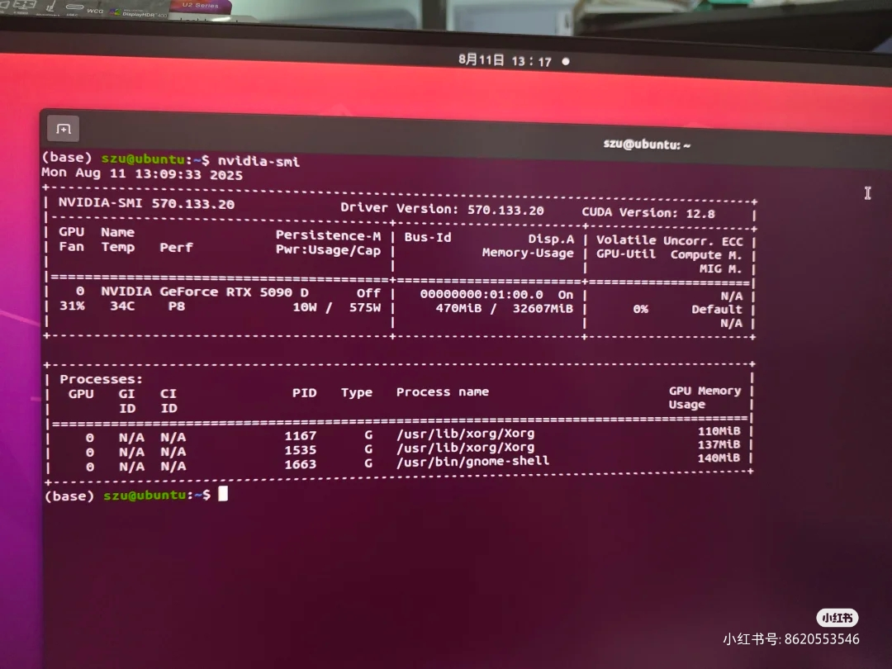
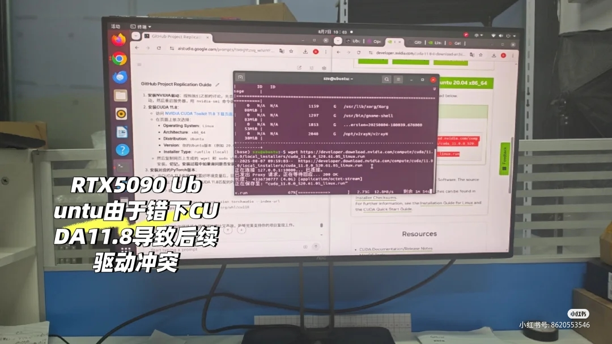
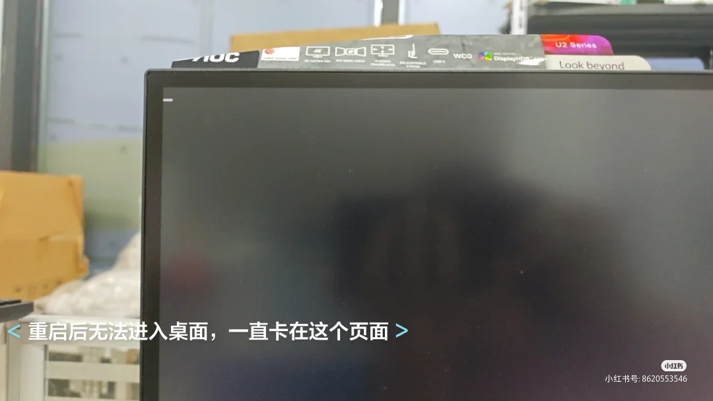
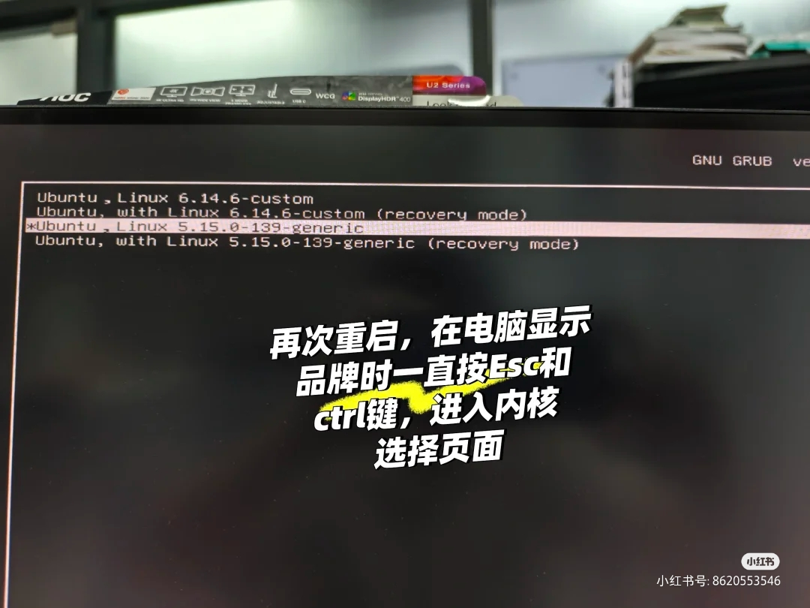
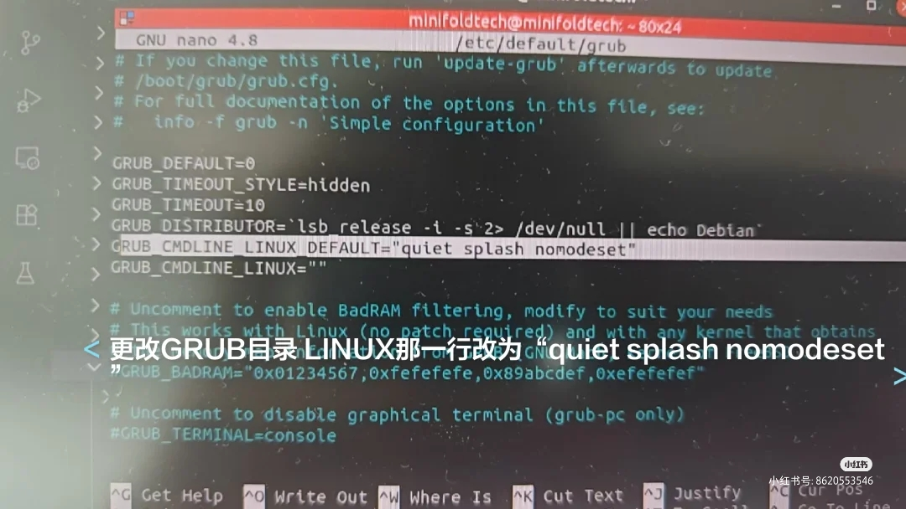
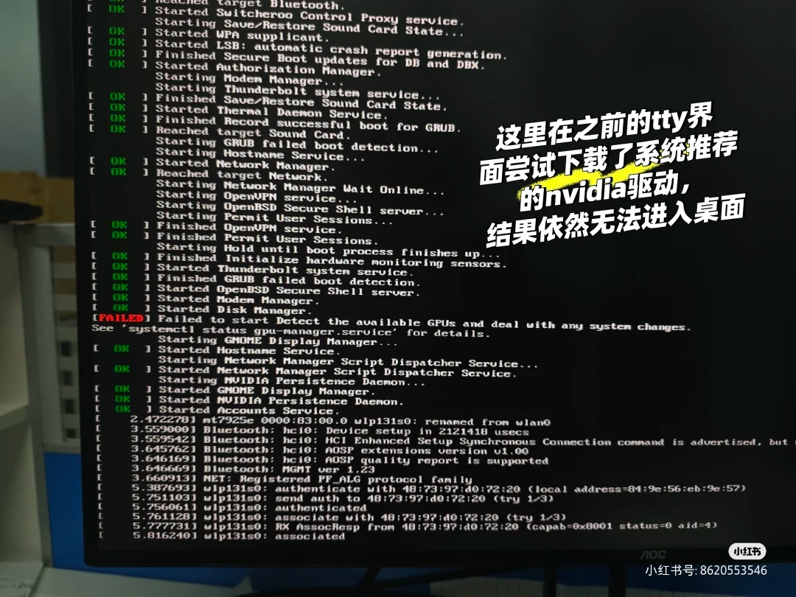
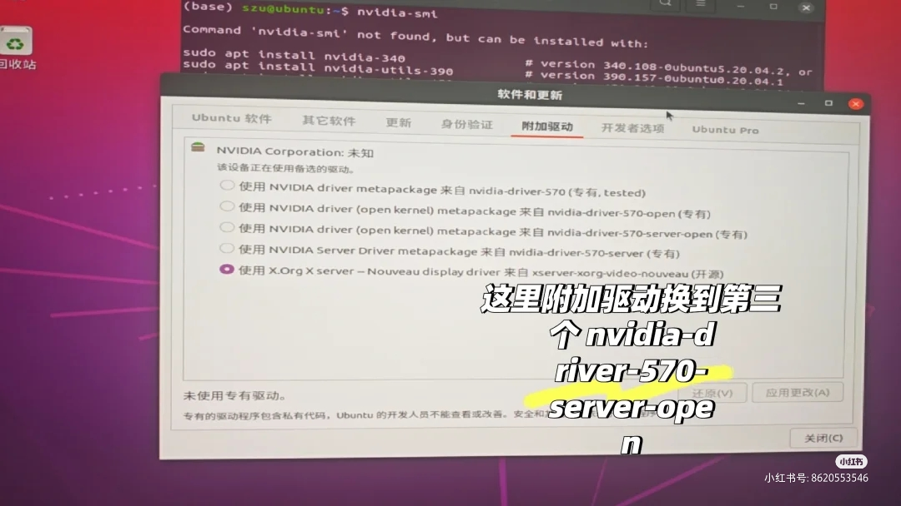

# RTX 5090 错装 CUDA 11.8 后驱动冲突与黑屏问题修复记录

> 一次 Ubuntu + RTX 5090D 环境下，由于误装 CUDA 11.8 引发 NVIDIA 驱动冲突、系统黑屏、无法进入桌面的完整排障记录。

<p align="center">
  
</p>

## 项目简介

在一台配有 **RTX 5090D** 的 Ubuntu 机器上，由于误装了 **CUDA 11.8**，系统随后出现了典型的显卡驱动冲突问题：

- 重启后黑屏
- 无法进入桌面环境
- NVIDIA 驱动状态异常
- `nvidia-smi` 无法正常使用

本文记录了我在 **不重装系统** 的前提下，逐步恢复系统与驱动可用状态的完整过程。

---

## 问题表现

这次故障的核心并不只是 “CUDA 安装失败”，而是 **错误的 CUDA / 驱动组合破坏了图形栈**，导致系统无法正常加载桌面环境。

典型现象包括：

- 系统重启后卡住
- 图形界面无法进入
- GPU 无法被正确接管
- NVIDIA 驱动加载失败

<p align="center">
  
</p>

<p align="center">
  
</p>

---

## 处理思路

我的处理思路很简单：

1. 先通过 **TTY** 或 **GRUB 恢复模式** 拿回控制权
2. 清理错误安装的 NVIDIA 相关包
3. 先让系统重新变得可进入
4. 再安装可用的正确驱动
5. 最后通过 `nvidia-smi` 验证修复结果

---

## 第一步：进入 TTY 或恢复模式

当系统无法进入桌面时，第一目标不是反复重启，而是先拿到一个可以执行命令的环境。

推荐方式：

- 按 `Ctrl + Alt + F3` 进入 TTY
- 或在 **GRUB -> Advanced options -> recovery mode** 中进入恢复模式

如果需要手动进入 GRUB，可以在开机时尝试连续按：

- `Esc`
- `Shift`
- `Ctrl`

<p align="center">
  
</p>

进入命令行环境后，就可以开始清理损坏的驱动栈。

<p align="center">
  
</p>

> 图中出现的 `unable to resolve host` 通常不是主因，真正的问题仍然是 NVIDIA 驱动和显示环境损坏。

---

## 第二步：清理冲突的 NVIDIA 包

我最先做的是把当前异常的 NVIDIA 相关包彻底清掉，并清理无用依赖：

```bash
sudo apt-get purge 'nvidia-*'
sudo apt-get autoremove -y
sudo update-initramfs -u
sudo reboot
````

### 为什么这一步重要

这一阶段最重要的不是立刻重装，而是先把冲突源头移除。这样可以：

* 清掉不兼容的驱动包
* 移除残留依赖
* 重建启动阶段相关的驱动状态

如果你之前还手动装过 CUDA，也建议额外检查这些位置：

* `/usr/local/`
* `/etc/modprobe.d/`
* 自定义的 `xorg.conf`

不要盲删，建议先检查再决定是否清理。

---

## 第三步：必要时使用 `nomodeset`

如果清理之后系统仍然无法进入桌面，可以先通过 `nomodeset` 临时降低图形初始化要求，让 Ubuntu 先启动起来。

编辑：

```bash
sudo nano /etc/default/grub
```

把：

```bash
GRUB_CMDLINE_LINUX_DEFAULT="quiet splash"
```

改成：

```bash
GRUB_CMDLINE_LINUX_DEFAULT="quiet splash nomodeset"
```

然后执行：

```bash
sudo update-grub
sudo reboot
```

<p align="center">
  
</p>

### `nomodeset` 的作用

这不是最终修复方案，它的作用只是：

* 先让系统能够进入
* 降低图形驱动初始化压力
* 给后续安装正确驱动创造条件

---

## 第四步：处理 GPU 检测失败的问题

在修复过程中，我还遇到了类似下面的报错：

**Failed to detect the available GPUs**

<p align="center">
  
</p>

这通常说明：

* 桌面服务已经开始尝试启动
* 系统正在加载图形栈
* 但 NVIDIA 驱动仍然没有正确接管 GPU

这时不要反复重装 CUDA，正确顺序应该是：

1. 先恢复一个可进入的系统环境
2. 再安装真正合适的 NVIDIA 驱动

---

## 第五步：必要时修复桌面环境

如果驱动清理后仍然无法进入桌面，也可能是桌面环境本身已经损坏。

这时可以尝试重装桌面组件与登录管理器：

```bash
sudo apt-get update
sudo apt-get install --reinstall ubuntu-desktop gdm3 -y
sudo reboot
```

这一阶段不是每台机器都必须做，但在以下情况下比较有帮助：

* GNOME 无法启动
* GDM3 异常
* 驱动已经清理过，但桌面仍然进不去

---

## 第六步：安装正确的 NVIDIA 驱动

系统重新变得可用之后，我通过下面的路径安装驱动：

**软件和更新 -> 附加驱动**

这里最重要的经验是：

> 不要盲目选择“看起来最新”的驱动，而要选择当前机器真正稳定可用的版本。

我最终成功使用的驱动是：

```text
nvidia-driver-570-server-open
```

<p align="center">
  
</p>

### 为什么这个驱动可行

对于这台机器和当前环境来说，`570-server-open` 的兼容性和稳定性比其他选项更好。

我的经验是：

* 默认桌面驱动不行时，可以尝试 **server** 分支
* 如果兼容性复杂，可以关注 **open kernel module** 版本
* “最新版”并不一定等于“最适合当前环境”

---

## 第七步：验证修复结果

驱动安装完成并重启后，执行：

```bash
nvidia-smi
```

如果能正常看到以下信息：

* GPU 型号
* Driver Version
* CUDA Version
* 显存占用
* 正在运行的进程

就说明驱动已经基本恢复正常。

<p align="center">
  
</p>

从最终结果可以看出：

* GPU 已经被正确识别
* 驱动版本为 `570.133.20`
* CUDA 版本已正常显示
* `Xorg` 和 `gnome-shell` 已经在使用显卡

这说明整个图形栈已经恢复到可用状态。

---

## 最简修复流程

如果只看最核心步骤，可以按下面的顺序处理：

### 1. 进入 TTY 或恢复模式

先拿到命令行控制权。

### 2. 清理异常 NVIDIA 包

```bash
sudo apt-get purge 'nvidia-*'
sudo apt-get autoremove -y
sudo update-initramfs -u
sudo reboot
```

### 3. 必要时添加 `nomodeset`

先让 Ubuntu 能重新进入系统。

### 4. 必要时重装桌面组件

```bash
sudo apt-get install --reinstall ubuntu-desktop gdm3 -y
```

### 5. 安装可用驱动

我最终使用的是：

```text
nvidia-driver-570-server-open
```

### 6. 使用 `nvidia-smi` 验证结果

---

## 经验总结

* RTX 5090 这类新卡不要随便搭配旧 CUDA 方案
* 黑屏之后优先考虑保系统，不要第一时间重装
* TTY 往往是最重要的自救入口
* 遇到驱动冲突时，顺序应该是 **先清理，再安装**
* **server / open** 分支驱动有时比默认桌面版更稳定
* 修复完成后一定要用 `nvidia-smi` 做最终验证

---

---

## 说明

本文基于一次真实的 **Ubuntu + RTX 5090D** 排障过程整理而成。不同机器环境下，结果可能会受到以下因素影响：

* 主板 / BIOS 设置
* 内核版本
* Secure Boot 状态
* 已有 CUDA 环境
* 之前安装过的 NVIDIA 相关包

因此在实际操作前，请结合自己的系统状态判断，尤其是在删除驱动包或修改启动配置时，建议先确认再执行。

---

## License

本仓库内容仅用于学习交流与问题记录。

```
```
